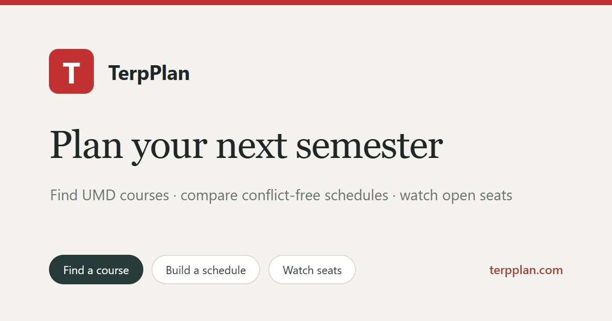

# TerpPlan

[Website](https://terpplan.com) · [Features](#features) · [中文介绍](#中文介绍)

**Plan your next semester at UMD.**

TerpPlan is a course-planning tool for University of Maryland students. Find courses, compare conflict-free schedules, review degree requirements, explore minors and double majors, and watch for open seats.

## 中文介绍

TerpPlan 是面向马里兰大学学生的选课与排课工具。你可以搜索课程、比较不冲突的课表、查看学位要求、评估辅修或双专业，并关注班级余位。

[打开 TerpPlan](https://terpplan.com)

## Features

- Search UMD courses and view term sections, meeting times, instructors, and the seat counts reported by umd.io. Instructor averages and on-demand, course-aware review excerpts come from PlanetTerp and link back to the source; unverified name matches are not shown as ratings.
- Review a uAchieve degree audit PDF at `/audit`: PDF text is extracted in the student's browser, unmet requirements are shown for correction, and only selected course IDs or a Gen Ed category are sent to lookup APIs. Candidate courses show current sections, seats, and available PlanetTerp historical average GPA; a student can add a course to the browser's term plan. Audit files, extracted text, names, and completed-course lists are not uploaded or saved by the Site. The feature was developed with the permission of the creator of [umd-course-recommender](https://github.com/wonder4hth/umd-course-recommender); its audit and recommendation workflow informed this integration.
- Explore a minor or a double major at `/minor` (`/minor?mode=major` opens the double-major view): compares the student's completed, in-progress, and planned courses (from an audit PDF read in the browser, typed codes, or the browser's plan) with a program's catalog requirements. It shows what already counts, what is left, overlap with the current major (a minor may share at most two courses / 6 credits; a second major has no fixed limit, and the page also checks the dual-degree rule of 18 credits not used for the other degree), prerequisites outside the program, the shortest prerequisite chain, and a workload estimate. Programs with several catalog tables (tracks, specializations, B.A. vs B.S.) let the student switch the applicable parts on and off; core tables are on by default. Requirements come from `data/umd-programs.json`, a snapshot of the UMD undergraduate catalog built by `node scripts/build-programs.mjs` (set `PROGRAM_HTML_CACHE=<dir>` to reuse downloaded pages); rebuild it when a new catalog is published. Rules the catalog writes only as prose appear as items the student checks off, and every result is labeled an estimate.
- Add courses to a planner that ranks up to three conflict-free section combinations using instructor ratings, early starts, gaps, and optional time/day preferences. Require a specific section or exclude individual sections before generating options; these choices stay with the browser's term plan. Compare options and view the selected option in a weekly timetable. TBA or incomplete meeting data is flagged for confirmation.
- Show the current term's selected course codes in a compact strip above course search, updated when courses are added, removed, or restored from this browser.
- Share a generated schedule with a compact link containing its term and exact section IDs. The read-only page reloads current meeting and seat data, shows unavailable sections clearly, and does not include email or seat-watch information.
- Show when TerpPlan last read seat data in course details, schedule results, and saved watches. This timestamp is not UMD's own update time; students should confirm seats in the official Schedule of Classes before registering.
- Save seat watches in the Site's D1 database, scoped to a verified email address. While the watch page is open, the browser checks at most once per minute and shows newly opened seats in the page. Client-provided ChatGPT identity headers are never accepted as authentication.
- Seat emails (opt-in): a signed-in student can turn on seat emails by re-entering the address they signed in with; only then is the raw address stored (`alert_subscriptions`). A background run (`POST /api/watches/run`, called about every 10 minutes by `.github/workflows/seat-check.yml` with `WATCH_RUNNER_SECRET`) merges all watches by term + course, reads each course once, and queues an alert only when open seats go from 0 to more than 0. It then sends at most one email per student per run (capped at 20 per day), each with a confirm-to-stop link (`/unsubscribe`) and one-click `List-Unsubscribe`. Openings older than an hour, or gone before sending, are dropped. Each student can watch up to 10 sections; watches are removed 150 days after creation.
- Email-code sign-in uses Resend. Before enabling it in production, configure `RESEND_API_KEY`, `EMAIL_FROM` (a verified sender), and a random `EMAIL_AUTH_SECRET` in Sites runtime secrets. The email address is sent to Resend to deliver sign-in codes; the app stores an HMAC hash for account scoping rather than the raw address. Codes expire after 10 minutes and are rate-limited.

The pilot does not copy local student profiles or databases. Seat-alert email is sent only after a student explicitly turns it on; email is used for sign-in codes and opted-in seat alerts, and no text alerts are sent. UMD seat counts can lag the official Schedule of Classes. The published Site is public; the original Python/FastAPI + Streamlit project remains in the parent folder.

## Repository layout

| Path | Purpose |
| --- | --- |
| `app/` | Pages, API routes, and page-specific components |
| `lib/` | Course, audit, schedule, sharing, and alert logic |
| `db/`, `drizzle/` | D1 schema and migrations |
| `data/` | Catalog snapshots used by the Site |
| `public/` | TerpPlan icons and social preview image |
| `build/`, `scripts/` | Site build and local tooling |
| `.openai/`, `.github/` | Site configuration and scheduled seat checks |
| `tests/` | Focused audit and recommendation tests |

Generated output (`dist/`, `.next/`), dependencies (`node_modules/`), and local runtime state are ignored. The separate Site source repository receives the same commit when a new version is published; pushing GitHub alone does not deploy it.
